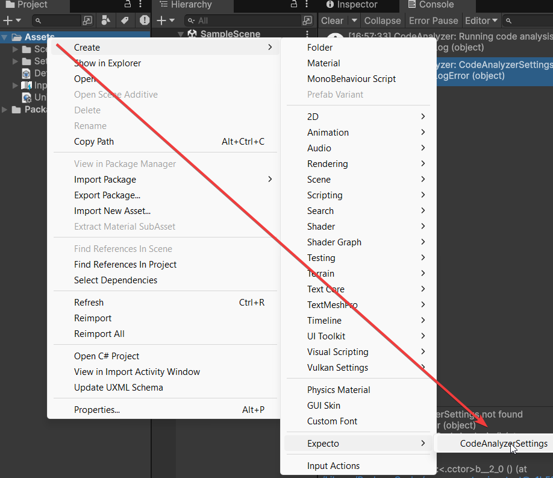
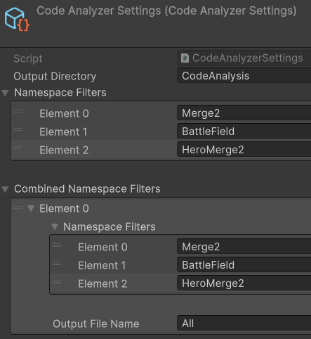
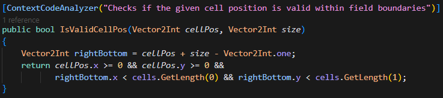
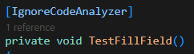

# Unity AI Context

A Unity tool that analyzes C# code structure and generates XML files with metadata about classes, methods, and fields. Specifically designed to provide enhanced context about project architecture for AI assistants and tools. Improves AI understanding of the project without the need to index all the code.

## Installation

### Via Package Manager

1. Open Package Manager in Unity (Window > Package Manager)
2. Click "+" in the top left corner
3. Select "Add package from git URL..."
4. Paste URL: `https://github.com/ErikTakoev/Unity-AI-Context.git`
5. Click "Add"

## Configuration

### Creating Settings

1. Select Create > Expecto > CodeAnalyzerSettings
2. You can move the created settings file to any folder in your project



3. Configure parameters:
   - Output Directory: directory to save XML files
   - Namespace Filters: namespaces to analyze
   - Combined Namespace Filters: namespaces to combine into a single XML file



## Usage

### Running Code Analysis

Code analysis starts automatically when Unity launches or scripts are recompiled. You can also run analysis manually:

1. Select Expecto > Code > Analyze Code in the Unity menu

### Using Attributes

#### ContextCodeAnalyzerAttribute

Adds additional context to a class, method, field, or property:

```csharp
[ContextCodeAnalyzer("This class is responsible for managing game state")]
public class GameStateManager : MonoBehaviour
{
    [ContextCodeAnalyzer("Current game state")]
    public GameState CurrentState { get; private set; }
    
    [ContextCodeAnalyzer("Transitions the game to a new state")]
    public void TransitionToState(GameState newState)
    {
        // ...
    }
}
```



#### IgnoreCodeAnalyzerAttribute

Excludes a class, method, or field from analysis:

```csharp
[IgnoreCodeAnalyzer]
public class DebugHelper
{
    // This class will be ignored during analysis
}
```



## Quick Project Context Population

For quick and efficient population of your project with context, the following sequence of actions is recommended:

### Step 1: Initial Analysis

1. **Generate initial XML file** using the Unity AI Context tool (Expecto > Code > Analyze Code)
2. **Add the generated XML file to a chat with an AI assistant** (Claude, GPT, Copilot, Cursor)
3. **Ask the AI to analyze the project architecture**:
   ```
   This is the project architecture, analyze it. Give a complete description.
   ```

### Step 2: Iterative Understanding Improvement

1. **Check and edit** the AI-generated description, correct inaccuracies
2. **Send corrections to the AI assistant** to improve its understanding
3. **Repeat the process** several times until the AI understands all aspects of the project

### Step 3: Adding Context via Attributes

Choose one of the options:

#### Option A: Via AI Agent in IDE (Cursor, Copilot)
1. **Ask the AI Agent to add attributes** to key classes, methods, and fields:
   ```
   Add ContextCodeAnalyzer attributes to important classes, methods, and fields in file *.cs, using information from our discussion
   ```
2. **Check and edit if necessary** the proposed changes
3. **Apply changes** to the project code

#### Option B: Via regular AI chat
1. **Ask the AI to generate an updated version of XML** with added context:
   ```
   Generate an updated version of XML with detailed context added to the "c" attribute for classes and methods
   ```
2. **Manually make changes** to the project code, adding appropriate `[ContextCodeAnalyzer("...")]` attributes

### Step 4: Finalization

1. **Regenerate the XML file** (Expecto > Code > Analyze Code)
2. **Check the result** with an AI assistant to ensure the context is understood
3. **If needed, repeat steps 2-4** for further context improvement

This sequential approach allows you to quickly enrich your project with contextual information, which significantly improves AI assistants' understanding of the project, especially for large and complex codebases.

## Integration with AI Assistants

### GitHub Copilot

Add generated XML files to the query context when working with Copilot Chat to get more accurate answers about the project architecture.

### Cursor

1. Open the generated XML file
2. Use the "Attach to Chat" function to add the file to the conversation context
3. Ask questions about the project architecture

### Claude, GPT, and Other AI Assistants

Add the contents of generated XML files to your queries when working on architectural tasks to provide AI with more context about the project structure.

## Output XML File Format

Generated XML files contain the following information:

```xml
<CodeAnalysis Namespace="Merge2">
  <!--XML attribute abbreviations: n — class name; b — base class name; c — context; v — value-->
  <!--Modifiers: '++' and '+' - public, '+-' - public getter, private setter, '~' - protected, '-' - private-->
  <Class n="Cell" b="MonoBehaviour" c="Represents a single cell in the game grid that can hold a chip">
    <Fields>
      <Field v="++ Chip: Chip" />
      <Field v="+- CellPosition: Vector2Int" />
    </Fields>
    <Methods>
      <Method v="+ Init(Vector2Int cellPos): void" c="Initializes the cell with its grid position" />
      <Method v="+ OnDrag(Vector2 position, bool isValidPosition): void" c="Called during dragging of a chip from this cell" />
      <Method v="+ OnDragEnd(Vector2 position): void" c="Called when drag ends for a chip from this cell" />
      <Method v="- GetChipCenterPosition(): Vector3" c="Gets the center position of the chip in this cell" />
    </Methods>
  </Class>
</CodeAnalysis>
```

Abbreviation explanations:
- **n** — class name
- **b** — base class
- **c** — context (description)
- **v** — value

Access modifiers:
- **++** and **+** — public
- **+-** — public getter, private setter
- **~** — protected
- **-** — private

## License

[MIT](LICENSE)

## Author

[Erik Takoev](https://github.com/ErikTakoev/)