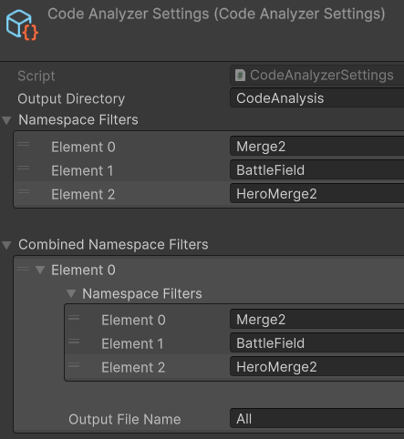

# Unity AI Context

🇺🇸 [English](README.md) | 🇺🇦 [Українська](README_UA.md)

Unity-інструмент для аналізу структури C# коду та генерації XML та Markdown файлів із метаданими про класи, методи та поля. Спеціально розроблений для покращення контексту для AI-асистентів і інструментів. Дозволяє AI краще розуміти архітектуру проєкту без необхідності індексувати весь код.

## Відео презентація

[](https://www.youtube.com/watch?v=Rfj9ufq07pU)

## Встановлення

### Через Package Manager

1. Відкрийте Package Manager у Unity (Window > Package Manager)
2. Натисніть "+" у верхньому лівому куті
3. Оберіть "Add package from git URL..."
4. Вставте URL: `https://github.com/ErikTakoev/Unity-AI-Context.git`
5. Натисніть "Add"

## Налаштування

### Створення налаштувань

1. У головному меню оберіть:  
   `Expecto > AI Context > Create Settings`
2. Файл `CodeAnalyzerSettings.asset` буде створено автоматично у папці `Assets/Expecto`.
3. За потреби перемістіть файл у бажану папку проєкту.
4. Налаштуйте параметри:
   
   **XML Generation**
   - Output Directory: директорія для збереження XML-файлів
   - Namespace Filters: простори імен для аналізу
   - Combined Namespace Filters: простори імен, які потрібно об'єднати в один XML-файл

   **Markdown Generation**
   - Generate Markdown: вмикає генерацію Markdown-файлів для зручного читання
   - Markdown Output Directory: директорія для збереження Markdown-файлів (за замовчуванням `Docs`)



## Використання

### Запуск аналізу коду

Аналіз коду запускається автоматично при старті Unity або перекомпіляції скриптів. Також можна запустити аналіз вручну:

1. У головному меню оберіть:  
   `Expecto > AI Context > Generate Context`

### Використання атрибутів

#### ContextCodeAnalyzerAttribute

Додає додатковий контекст до класу, методу, поля або властивості:

```csharp
[ContextCodeAnalyzer(
  @purpose: "Attempts to generate a new chip if the generator is charged and there is free space.",
  @usage: "Call when generator is charged and a chip needs to be generated, either automatically or manually.",
  @returns: "True if a chip was generated, false otherwise.",
  @notes: "Handles charge decrement, state transitions, and chip creation. Sets waiting state if no space is available."
)]
private bool TryGenerateChip()
{
    ...
}
```

#### IgnoreCodeAnalyzerAttribute

Виключає клас, метод або поле з аналізу:

```csharp
[IgnoreCodeAnalyzer]
private void TestFillField()
{
    ...
}
```

## Швидке наповнення проєкту контекстом
1. **Файл правил:** [context-guidelines.mdc](Rules/context-guidelines.mdc) — додай правило для cursor, або використовуй як контекст
2. **Промпт:** `"Add context for classes, methods, and fields according to the rules in @context-guidelines.mdc"` — використовуй цей точний текст для кращих результатів
3. **Запусти** AI-агент на твоїх файлах коду
4. **Перевір** згенеровані контекстні атрибути


## Формат вихідного XML-файлу

Згенеровані XML-файли містять таку інформацію:

```xml
<CodeAnalysis Namespace="Merge2">
  <Class n="ChipGenerator" b="Chip" c="Purpose: Represents a chip that can generate other chips, supporting both automatic and manual generation modes.; Usage: Attach to a cell in the game field. Initialize with ChipData. Handles chip generation, charging, and visual effects.; Notes: Manages event subscriptions, runtime state, and effect activation. Key for gameplay mechanics involving chip creation and field interaction.">
    <Fields>
      ...
      <Field v="- generatorData: ChipGeneratorData" c="Purpose: Stores static configuration for the chip generator.; Usage: Initialized in Init from ChipData. Used for generation logic.; Notes: Should not be null. Affects generator mode and chip creation." />
      ...
    </Fields>
    <Methods>
      ...
      <Method v="- TryGenerateChip(): bool" c="Purpose: Attempts to generate a new chip if the generator is charged and there is free space.; Usage: Call when generator is charged and a chip needs to be generated, either automatically or manually.; Returns: True if a chip was generated, false otherwise.; Notes: Handles charge decrement, state transitions, and chip creation. Sets waiting state if no space is available." />
      ...
    </Methods>
  </Class>
</CodeAnalysis>
```

Пояснення скорочень:
- **n** — ім'я класу
- **b** — базовий клас
- **c** — контекст (опис)
- **v** — значення

Модифікатори доступу:
- **++** та **+** — public
- **+-** — public getter, private setter
- **~** — protected
- **-** — private

## Генерація Markdown документації

Інструмент автоматично генерує Markdown файли, які зручно читати людям. Вони містять:
- Структурований зміст (Table of Contents)
- Інформацію про наслідування
- Красиво відформатований контекст (Code Analyzer Context) з виділеними ключами
- Списки полів та методів з їх описами

Це дозволяє використовувати згенеровану документацію як для AI, так і для розробників.

## Ліцензія

[MIT](LICENSE)

## Автор

[Erik Takoev](https://github.com/ErikTakoev/)